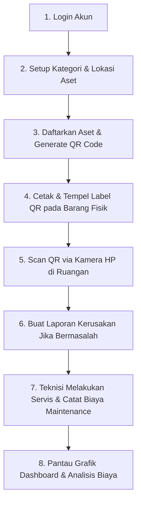

# 🏢 SIMAFTI — Sistem Informasi Manajemen Aset FTI UKSW

> **SIMAFTI (Sistem Informasi Manajemen Aset Fakultas Teknologi Informasi)** adalah platform berbasis web modern yang dirancang untuk mengelola, memantau, dan memelihara seluruh aset fisik Sarana & Prasarana (Sarpras) di FTI UKSW — mulai dari komputer laboratorium, proyektor, pendingin ruangan (AC), perangkat jaringan, hingga kendaraan operasional.

---

## 🎯 1. Deskripsi & Tujuan Sistem

Sistem ini hadir untuk mengeliminasi pencatatan inventaris manual berbasis kertas/Excel, menyajikan solusi terintegrasi berbasis **QR Code** dan **Analisis Grafik Realtime**.

### 🌟 Tujuan Utama:
1. **Digitalisasi Pendataan Aset Fisik:** Pencatatan terpusat untuk seluruh aset fisik laboratorium dan gedung FTI.
2. **Identifikasi Cepat via QR Code:** Tiap unit fisik ditempeli stiker QR Code unik yang dapat di-scan langsung menggunakan kamera Smartphone di lapangan.
3. **Tracking Biaya Pemeliharaan (Maintenance):** Mencatat riwayat pemeliharaan, jadwal servis berkala, dan akumulasi pengeluaran biaya perbaikan.
4. **Respon Cepat Pelaporan Kerusakan:** Memudahkan civitas akademika dan staf dalam melaporkan barang rusak serta memantau status perbaikannya secara transparan.
5. **Dashboard Analytics untuk Eksekutif:** Menyajikan grafik kondisi aset, rasio operasional, dan grafik pengeluaran biaya perbaikan per periode.

---

## 🛠️ 2. Teknologi Yang Digunakan (Tech Stack)

### **Backend (API Server)**
* **Framework:** Laravel 11 (PHP 8.2+)
* **Authentication:** Laravel Sanctum (Token-Based SPA Authentication)
* **Database:** MySQL / SQLite
* **Architecture:** RESTful API Architecture (JSON Resources)

### **Frontend (Client App)**
* **Library UI:** React 19 + Vite 8
* **Styling:** Tailwind CSS v4 (Custom Blueprint Color Tokens & High Contrast Dark Mode)
* **Charts & Analytics:** Chart.js + React-Chartjs-2
* **QR Code Engine:** `qrcode.react` (Client-side rendering & PNG export) + Custom Viewfinder `<ScanFrame>`
* **HTTP Client:** Axios Interceptor

---

## 👥 3. Peran Pengguna & Hak Akses (User Roles)

Sistem mengimplementasikan **Role-Based Access Control (RBAC)** untuk 3 peran utama:

| Peran (Role) | Hak Akses Utama |
| :--- | :--- |
| **Admin Sarpras** | **Full Access:** Pengelolaan Master Kategori, Lokasi, Tambah/Edit/Hapus Aset, Cetak Label QR Code, Pengaturan Jadwal Servis, Hapus Log & Laporan, serta Akses Dashboard Analytics. |
| **Teknisi** | **Akses Pemeliharaan:** Mencatat tindakan servis (*Maintenance Log*), menginput biaya perbaikan, dan mengupdate status Laporan Kerusakan (*Dalam Perbaikan / Selesai*). |
| **User / Civitas** | **Akses Informasi & Pelaporan:** Melihat daftar aset, melakukan scan QR Code via HP, serta membuat Laporan Kerusakan jika menemukan barang yang bermasalah. |

---

## 🔄 4. Alur Penggunaan Aplikasi (POV User Step-by-Step)



### 📋 Panduan Fitur Step-by-Step:

#### **Step 1: Login & Autentikasi (`/login`)**
* Masukkan email & password terdaftar.
* Sistem mendukung **Toggle Mode Gelap (Dark Mode)** dan **Mode Terang (Light Mode)** di navigasi atas.

#### **Step 2: Kelola Master Data (`/asset-categories` & `/locations`)**
* **Kategori Aset:** Buat kelompok barang (misal: *Elektronik, Meubel, Peralatan Laboratorium, Kendaraan*).
* **Lokasi Aset:** Buat pemetaan gedung dan ruangan (misal: *Gedung F - Ruang FTI 101, Lab Komputer 3, Ruang Dekanat*).

#### **Step 3: Pendataan Aset & Generate QR Code (`/assets`)**
* Klik **+ Tambah Aset**, isi data nomor seri/kode aset, nama barang, lokasi, kategori, tanggal beli, dan harga barang.
* Sistem otomatis membuat **QR Code Unik** yang mengarah ke URL spesifikasi detail aset tersebut.

#### **Step 4: Cetak & Tempel Label QR Physical Sticker (`/assets/:id`)**
* Buka Detail Aset, klik **Cetak Label**.
* Cetak stiker label QR berlogo **SIMAFTI — FTI UKSW** dan tempelkan pada unit barang fisik di ruangan (misal di bodi proyektor atau unit AC).

#### **Step 5: Pemindaian QR Code di Lapangan via HP (`Scan QR`)**
* Buka Kamera HP (iPhone / Android) atau fitur **Scan QR** pada aplikasi.
* Arahkan ke label QR barang fisik ➔ HP akan langsung membuka halaman spesifikasi, kondisi, dan riwayat barang secara instan.

#### **Step 6: Pelaporan Kerusakan (`/damage-reports`)**
* Jika menemukan barang rusak di kelas/lab, buat laporan baru berisi deskripsi kendala.
* Status laporan akan berjalan dari *Dilaporkan* ➔ *Dalam Perbaikan* ➔ *Selesai*.

#### **Step 7: Servis & Pencatatan Biaya (`/maintenance-logs`)**
* Teknisi yang menangani perbaikan menginput tindakan yang diambil dan **Biaya Servis (Rp)** yang dikeluarkan.

#### **Step 8: Monitoring Dashboard Eksekutif (`/`)**
* Menampilkan 4 Kartu Metrik Utama (Total Aset, Valuasi Rp, Kondisi Baik %, dan Biaya Maintenance).
* Visualisasi **Doughnut Chart Kondisi Aset**, **Line Chart Tren Biaya Maintenance per Bulan**, serta **Bar Chart Distribusi Kategori**.

---

## ⚡ 5. Panduan Instalasi Lokal (Local Setup Guide)

### **Prasyarat (Prerequisites)**
* PHP >= 8.2
* Composer
* Node.js >= 18.x & NPM
* MySQL / SQLite

### **1. Setup Backend (Laravel API)**
```bash
# Masuk ke direktori backend
cd backend

# Install dependensi PHP
composer install

# Salin file environment
cp .env.example .env

# Generate Application Key
php artisan key:generate

# Jalankan Migrasi & Seeder Database
php artisan migrate --seed

# Jalankan Server Backend (Host 0.0.0.0 agar bisa di-scan dari HP)
php artisan serve --host=0.0.0.0 --port=8000
```

### **2. Setup Frontend (React + Vite)**
```bash
# Masuk ke direktori frontend
cd ../frontend

# Install dependensi Node.js
npm install

# Jalankan Frontend Dev Server (Host Mode)
npm run dev
```

---

## 📄 6. Lisensi & Hak Cipta

Diproduksi untuk **Fakultas Teknologi Informasi (FTI) - Universitas Kristen Satya Wacana (UKSW)**.
Seluruh hak cipta dilindungi undang-undang.
